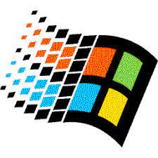

# Markdown Syntax

## What is Markdown?
Markdown is a simple text formatting language used to define how content appears on a page. It's similar to HTML but easier to write. It covers headings, text styles, links, lists, and more.

## Why use Markdown?
Markdown offers several advantages:

- **Ease of Use:** Markdown's simple syntax reduces the need to remember complex HTML tags.

- **Diversification** Because Markdown is plain text, it's versatile and can be converted into various formats such as PDF, ePub, Docx, HTML, and more.

- **Adoption:** It's used in numerous applications like GitHub, forums, and more.

- **Great for Version Control:** Markdown files work great with version control systems like Git. This allows for efficient collaboration and tracking of changes.


# Markdown Elements


<!-- This is how you create a comment -->

## Headers (it's like HTML h1,h2...)
# 1
## 2
### 3
#### 4
##### 5
###### 6

## Emphasis
*Italic* or _Italic_
**Bold** or __Bold__
**_Bold and Italic_**
***BOLD AND ITALIC***
or like `that`

## Task List
- [x] Task 1
- [ ] Task 2
- [ ] Task 3

## Lists

### UL
* FIRST ITEM
    - Subitem
    - Subitem2

- SECOND ITEM
    - Subitem of the second
    - Subitem of the third

+ LAST ITEM

<!-- This is how you comment and uncomment -->
<!-- To comment: CTRL K + CTRL U -->
<!-- To uncomment: CTRL K + CTRL C -->


### OL
1. FIRST ITEM
    1. Subitem 1
    2. Subitem 2
2. ITEM 2
    1. Subitem 1 of 2
    2. Subitem 2 of 2

## Links
[Gugul](http://google.com)

[X](http://x.com)

## Images



## Quote
> a quote

## Code
```html
    <head>
    <title>Test</title>
    </head>
```

## Line
--- 
___


## Table
| ID | USERS |
| ----------- | ----------- |
| 1| TECMIPRUEBAS       |
| 2 | TECMIPRUEBASPEROCONID2        |

## CROSSED TEXT
~~TEXTO~~
